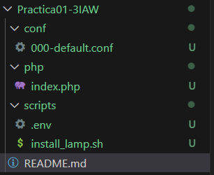

# Practica01-3IAW
Este repositorio es para la Práctica 1 apartado 3 de IAW

## Primeros pasos
- Como primer paso hacemos un *git clone* del repositorio de Practica 1 para copiar una serie de archivos. 

- Estos son los archivos que queremos tener:

- 

