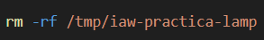
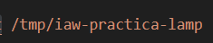
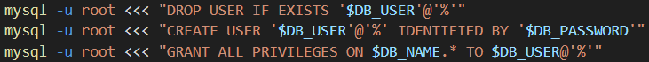
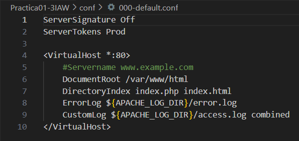

# Practica01-3IAW
Este repositorio es para la Práctica 1 apartado 3 de IAW

## Primeros pasos
- Como primer paso hacemos un *git clone* del repositorio de Practica 1 para copiar una serie de archivos. 

- Estos son los archivos que queremos tener:

- 

- Una vez tengamos el script de la primera práctica, lo lanzamos. Al fin y al cabo este script nos ha ayudado a optimizar de manera mucho más rapida la instalación de la pila lamp.

## Creación del nuevo script.

- El nuevo script que tendremos que crear se llamara *_deploy.sh_* y en el implantaremos los nuevos comandos que tenemos que utilizar.

- Muy importante añadir las variables del *_.env_* en nuestro script. Como primer paso tendremos que eliminar las descargas del directorio */tmp* 

- *tmp* es un directorio temporal. 

      

## Clonamos el repositorio desde Git.

- Tenemos que clonar el repositorio de GitHub de nuestro profesor para poder continuar con la descarga.

- [Enlace al repositorio de Jose Juan en GitHub.](https://github.com/josejuansanchez/iaw-practica-lamp.git)

- Muy importante que cuando hagamos el _clone_ lo guardemos en el directorio.

    

## Movemos el código fuente de la aplicación.

- Tendremos que mover el código fuente a nuestro directorio *_/var/www/hmtl_*. Lo haremos haciendo uso del siguiente comando.

- `mv /tmp/iaw-practica-lamp/src/* /var/www/html`

- La funcionalidad de este comando es copiar todo lo que hay dentro de la ruta, en el otro directorio. 

# Configuramos el archivo config.php de la aplicación.

- Esta apartado es mas complejo debido a que tenemos que configurar el archivo de _php_ para que pueda detectar las variables que tenemos guardadas en *_.env_*

- Lo podemos hacer usando el comando _sed_ _-i_ que nos permite poder buscar una cadena de palabras y con el parametro de la _-i_ nos hace cambiarlo de manera permanenten.

- Los comandos que tenemos que hacer uso son los siguientes:

    **1. Comando:**  `sed -i "s/database_name_here/$DB_NAME/" /var/www/html/config.php`

    **2. Comando:** `sed -i "s/username_here/$DB_USER/" /var/www/html/config.php`

    **3. Comando:** `sed -i "s/password_here/$DB_PASSWORD/" /var/www/html/config.php`

# Modificamos el script de la base de datos.

- Este es un apartado en que vamos a cambiar un parametro de los que tenemos dentro de nuesta *_.env_* para que podamos cambiar el nombre de la base de datos por el que queramos poner en nuestro archivo de variables sin que nos de ningun fallo.

- El comando que tenemos que utilizar es de nuevo el *_sed -i_* para buscar el parametro que necesitamos y cambiarlo.

- El comando de forma completa es el siguiente: `sed -i "s/lamp_db/$DB_NAME/" /tmp/iaw-practica-lamp/db/database.sql`

## Iniciamos sesión en MySql. Y creamos la base de datos haciendo uso de >>>.

- Una vez configurado todo lo anterior tendrmeos que acceder a nuestro mysql haciendo uso del comando que hemos utilizado en las otras prácticas.

- `mysql -u root < /tmp/iaw-practica-lamp/db/database.sql`

- Lo único que cambia es la ruta del directorio de donde queremos obtener la información.

## Creamos la base de datos.

- Hacemos uso de *_<<<_* que nos permite poder insertar cadenas de texto dentro de mysql desde un script.

- Aquí podemos ver los comandos: Importante poner bien las variables con el `$` 

    

### Captura del archivo 000-default.conf

- Adjunto captura para no perder la configuración de este archivo.

    
